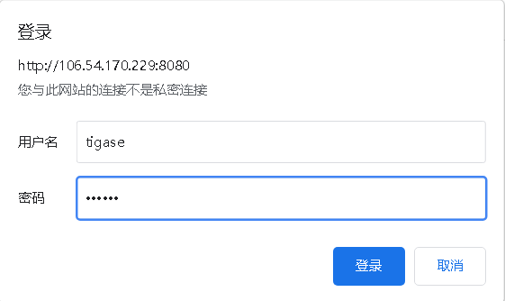
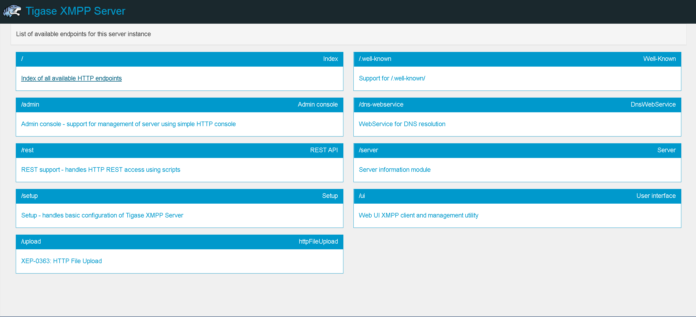

#### Tigase服务
* 安装
* 配置
* 证书
* 使用

---
## 环境要求
> 特别说明：需使用 `openjdk` 11及以上版本

## 安装
> 这里有两种安装包，一种源码包方便扩展一种server直接部署配置
- 下载地址: `https://tigase.net/xmpp-server`
- 解压打开/etc/tigase.conf 配置JAVA_HOME 配置地址未openjdk安装路径
  
- 打开 `ip:8080` username:admin password:tigase

- 根据步骤一步步配置，配置成功后重启Tigase
> ./scripts/tigase.sh stop
>  
> ./scripts/tigase.sh start etc/tigase.conf

## 配置
- admin 超管控制台，基本所有的配置都在这里配置
- rest,server,ui,setup 等等